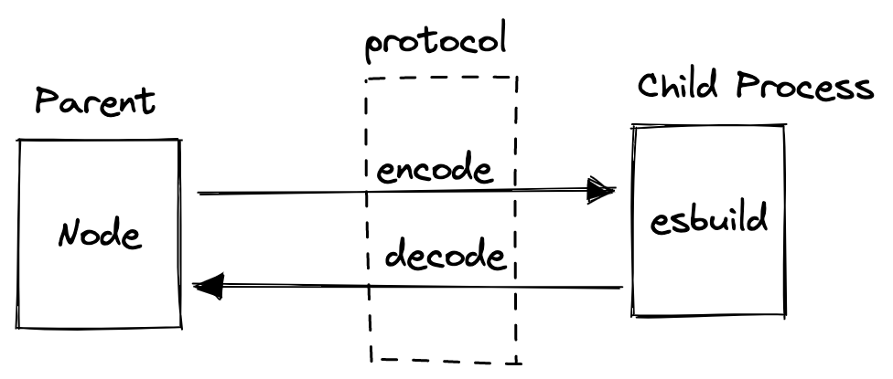

# 由 esbuild JavaScript API 看跨语言调用


## 本文探讨的主题

[esbuild](https://esbuild.github.io/) 是使用 Go 语言实现的打包工具，配置简单，编译速度快，被广泛应用。esbuild 提供了 JavaScript API，完全兼容 JavaScript 生态。下面的例子来自 esbuild 官网。

```ts
import { transformSync } from 'esbuild';

transformSync('let x: number = 1', {
  loader: 'ts',
});
```

看到这里，你也许会发出这样的疑问：esbuild 是 Go 语言实现的，但在 JavaScript 中，我们却可以把它当做一个普通的 npm 包调用？它是如何实现跨语言调用的？本文就来探讨这个问题。

## 进程间通信

根据直觉来推断，进程间通信正好可以实现这个效果。可以用一个简单的例子来验证猜想对不对。

[vite](https://vitejs.dev/) 是纯 JavaScript 实现的，依赖了 esbuild。让我们先随便新建个 vite 项目，然后执行 `yarn run dev` 启动 vite。使用 `ps` 命令找到当前进程 ID，再使用 `pstree` 来观察进程之间的关系。

```
-+= 97048 user node .../yarn.js run dev
 \-+- 97055 user node .../.bin/vite
   \--- 97059 user .../esbuild --service=0.13.15 --ping
```

`pstree` 的输出结果清晰地描述进程之间的关系，正好验证了刚才的猜想。

### 初步实现

esbuild cli 有如下两种使用方式：

```bash
# 1
cat src/main.ts | esbuild --loader=ts

# 2
esbuild src/main.ts
```

执行命令后，会在控制台输出编译之后的代码。将上述 shell 改成等效的 Node 代码。

```ts
import { spawn } from 'child_process';

const esbuild = spawn('./node_modules/esbuild-darwin-64/bin/esbuild', [
  'package.json',
]);

esbuild.stdout.on('data', (chunk) => {
  console.log(chunk.toString());
});
```

但是当前的实现方式缺点很明显：

- 一次只能编译一个文件
- 编译多个文件的话，频繁创建进程

### 改进

更好的方式是 esbuild 在启动之后一直保持运行，向该进程 `stdin` 写入数据，同时对进程的 `stdout` 进行解码。

留意到前文中 esbuild 启动方式是这样的：

```bash
esbuild --service=0.13.15 --ping
```

加上 `--ping` 参数可以让 esbuild 进程保持运行不退出，从而不断的接受来自 `stdin` 的请求。

## 通信协议

### 模型构建

借助进程的 stdin/stdout 可以实现通信。在此之上，还需要定义传输的数据。esbuild 定义 `Packet` 结构来描述传输的数据：

```ts
export interface Packet {
  id: number;
  isRequest: boolean; // 一般都为 true
  value: Value;
}
```

其中 `value` 字段表示协议的内容。比如 `TransformRequest` 表示文件转换请求，`TransformResponse` 则代表了转换请求的响应。

```ts
type Value = TransformRequest | TransformResponse | Others;

export interface TransformRequest {
  command: 'transform';
  flags: string[];
  input: string;
  // ...
}

export interface TransformResponse {
  code: string;
  // ...
}
```

### 序列化与反序列化

序列化是将对象的状态信息转换成可取用格式，以留待后续其他的程序能读取出来反序列化对象的状态，重新创建该对象。我们接触最多是 JSON 的序列化与反序列化。类似的，我们需要将 `Packet` 对象进行序列化与反序列化。

esbuild 通信的消息采用的定长编码。如下图所示，消息的前 4 个字节为消息体长度，后面跟着消息的内容。

```
+---+---+---+---+---+---+---+---+---+----+
| 1 | 2 | 3 | 4 | 5 | 6 | 7 | 8 | 9 | .. |
+---+---+---+---+---+---+---+---+---+----+
|     length    |          body          |
+---------------+------------------------+
```

不同的数据，对应着不同的转换规则。可以将数据分为两类：

- 定长：boolean/uint32/null

- 不定长数据：array/string/object

数据生成的字节编码格式如下。用 1 字节表明数据的类型，用可选的 4 个字节表明数据的长度，最后一部分就是数据的实际内容。

```
+------+---+---+---+---+---+---+---+----+
|   1  | 2 | 3 | 4 | 5 | 6 | 7 | 8 | .. |
+------+---+---+---+---+---+---+---+----+
| type |    <length>   |     content    |
+------+---------------+----------------+
```

还有一点需要注意的是字节序，esbuild 协议采用的是小端序。下方的例子可以帮助我们理解字节序。

```js
const buffer = Buffer.from([0x01, 0x02, 0x03, 0x04]);
buffer.readUInt32LE(); // = 67305985
buffer.readUInt32BE(); // = 16909060 = 0x01020304
```

以字符串 `abc` 为例，序列化之后如下：

```
+-----+----+----+----+----+----+----+----+
|  1  | 2  | 3  | 4  | 5  | 6  | 7  | 8  |
+-----+----+----+----+----+----+----+----+
|  03 | 03 | 00 | 00 | 00 | 61 | 62 | 63 |
+-----+----+----+----+----+----+----+----+
| str |     length: 3     | a  | b  | c  |
+-----+-------------------+----+----+----+
```

到这里我们已经理清了整个过程。用一张图来概括上文的内容。



## 实现

原理介绍完毕后，开始动手写点代码。

#### 编解码器 (Codec)

在实现编解码器前，先实现一个能自动扩容的 Buffer 来屏蔽对数据的读写细节。

```ts
export class PacketBuffer {
  private buffer: Buffer;

  scale() {}

  writeUint32() {}

  readUint32() {}
}
```

然后实现 `encode` 与 `decode` 方法。

```ts
export function encode(packet: Packet): Buffer {
  const buffer = new PacketBuffer();
  buffer.writeUint32(id);
  // ...
  return buffer.slice();
}

export function decode(buffer: PacketBuffer): Packet {
  // ...
  return packet;
}
```

### 流的读写

进程通信时，处理的数据都是面向流的，需要将 `Packet` 编码后写入流或者将流转换成 `Packet`。写的过程比较简单，读的过程稍微复杂一下，采用两个 Transform 流来处理。先使用 `FixedLengthTransform` 将流按照固定长度进行切分，接下来使用 `PacketTransform` 来完成字节流到 `Packet` 的转换。

```ts
import { pipeline } from 'stream';

// 将流按照包体的长度进行拆分
export class FixedLengthTransform extends Transform {}

// 将流转换成 Packet 对象
export class PacketTransform extends Transform {}

const transform = pipeline(
  esbuild.stdout,
  new FixedLengthTransform(),
  new PacketTransform(),
  handlerError(),
);

transform.on('data', (packet) => {});
```

### API 封装

把上面的过程组装在一起，就可以像 [esbuild](https://www.npmjs.com/package/esbuild) 这个 npm 包一样对外暴露 JavaScript API 了。用户按照自己的需要调用相应的函数即可。

```ts
export class API {
  transformTs(code: string) {}

  transformJson(code: string) {}

  transform(code: string, option: Option) {}
}
```

完整的代码点击[这里](https://gitlab.huolala.cn/hll-fe/dig-esbuild-interop)查看。如果你想深入研究 esbuild 的细节，点击[这里](https://github.com/evanw/esbuild/tree/v0.13.15/lib/npm)查看 esbuild 官方 npm 包源码。吐槽一句：esbuild 仓库里 ts 代码风格很古怪，阅读前需留意。

## RPC

上文介绍跨进程（跨语言）通信，是不是可以被视作一个极简版的 RPC (Remote Procedure Call) 呢？只不过这个场景下没有网络通信，`Remote` 一词没有体现出来。但是对于前端开发者而言，我们从一个侧面来理解 RPC 的核心概念。

## 总结

在前端工具链领域，使用 Go/Rust 开发的打包工具层出不容，其中以 Go 实现的 esbuild 与 Rust 实现 [swc](https://swc.rs/) 最为流行。本文以 esbuild JavasScript API 为切入点，分析跨语言 API 的实现原理，从而更好地帮助读者理解打包工具。

另外本文重点分析 esbuild 二进制协议的设计与编解码实现，读者在阅读完后可以掌握 Node 进程与流的相关知识，自定义协议的编解码，从而更好地理解 RPC 相关的概念。

### 参考资料

- [聊聊字节跳动 Node.js RPC 的设计实现](https://mp.weixin.qq.com/s/Ky6SoWJv85orqYioihTRqg)
- [Node Child Process 文档](https://nodejs.org/dist/latest-v14.x/docs/api/child_process.html)
- [理解字节序](https://www.ruanyifeng.com/blog/2016/11/byte-order.html)
